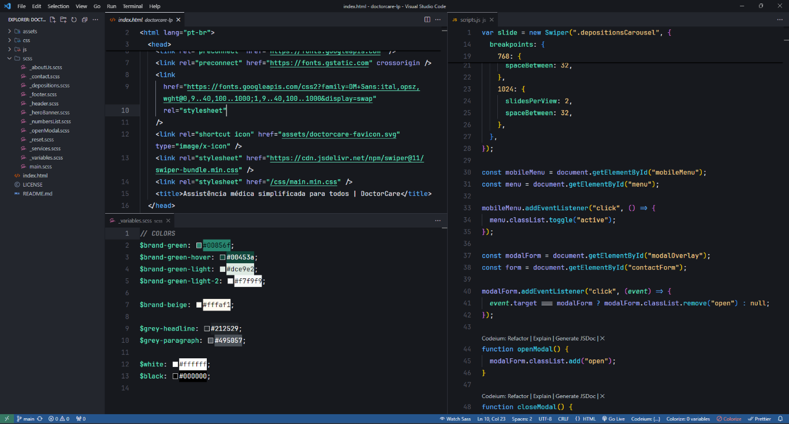

# 👁️ Minimal VSCode Settings

## ⚙️ Steps
1. Copy the content from  `settings.json` file
2. press `ctrl + shift + p` on your VS Code and search for `Preferences: Open User Settings (JSON)`
3. Just paste what you copied and save your file
4. Done!
